# 📄 Smart Multi-Service Booking and Management System

**Faculty:** Dr. Deepak Sharma  
**Project Type:** AI-powered full-stack service marketplace  
**Team:** Dev-1 (me), Dev-2 (Aastha)  
**Document:** Official System Architecture & Team Collaboration Blueprint  
**Version:** v0.1  
**Date:** 13 August 2026  

## Technology Stack

| Layer | Technology | Architectural Role |
|---|---|---|
| Customer, Provider, Admin UI | React, React Router, TypeScript | Role-based web interfaces |
| Backend API | FastAPI, Python, Pydantic | REST APIs, validation, orchestration |
| Authentication | JWT, OAuth-compatible identity layer, RBAC | Secure session and authorization |
| Core Database | PostgreSQL | Transactional source of truth |
| Cache and ephemeral data | Redis | Caching, rate limits, presence, temporary state |
| Event Streaming | Apache Kafka | Domain events, asynchronous processing |
| Realtime Transport | WebSockets | Chat, status, location, ETA, notifications |
| AI/ML | Python services, LLM APIs, scikit-learn-compatible pipelines | Recommendations, prediction, classification |
| RAG | LLM API, embeddings, vector database | Support knowledge retrieval and grounded answers |
| Maps and Location | Maps API, browser/mobile geolocation APIs | Discovery, routes, ETA, geofencing |
| File Storage | S3-compatible object storage | Certificates, profile images, evidence documents |
| Payments | Cash-on-Delivery/pay-after-service v1, Razorpay advanced | Payment collection and reconciliation |
| Notifications | Email provider, in-app notifications, WhatsApp advanced | Customer and provider communication |
| Packaging | Docker, Docker Compose | Consistent local and deployment environments |
| CI/CD | GitHub, Jenkins, container registry | Automated testing, builds, deployments |
| Edge and Security | Cloudflare DNS, CDN, SSL, WAF, rate limiting | Secure public access and traffic management |
| API Contract | OpenAPI generated by FastAPI | Frozen `/docs` integration contract |

---

# 🏛️ System Architecture & Workflow Topology

The **SmartServe** platform is architected as an event-driven, micro-modular service ecosystem designed for extreme concurrency, sub-second geospatial telemetry, explainable AI matching, and zero-loss transactional consistency.

The end-to-end workflow topology is partitioned into seven distinct, orchestrated phases—spanning client ingestion, distributed locking, high-frequency IoT/GPS tracking, dual-rail settlement, automated AI feedback loops, and LangGraph-driven GenAI support.

```mermaid
flowchart TD
    %% ==========================================
    %% PHASE 1: INGESTION, EDGE SECURITY & IDEMPOTENCY
    %% ==========================================
    subgraph Phase1 ["1. INGESTION, EDGE SECURITY & IDEMPOTENCY"]
        P1_CLIENT["📱 Multi-Channel Client Ingestion<br/>(Customer, Provider & Admin React Web / PWA)"]
        P1_EDGE["🛡️ Cloudflare Enterprise Edge<br/>(WAF, DDoS Shield, TLS 1.3 Termination, Global CDN)"]
        P1_GATEWAY["⚡ FastAPI Gateway & Security Filter<br/>(Argon2id Hash, JWT Bearer Claims, RBAC Interceptor)"]
        P1_HASH["🔐 SHA-256 Request Fingerprinting<br/>(Payload Digest & Client Nonce Generation)"]
        P1_IDEM_CHECK{"🔍 Check Idempotency Key &<br/>Unique Constraint in Redis"}
        P1_CACHED["🔁 Return Cached Idempotent Response<br/>(200 OK Replay / 429 Rate-Limited)"]
        P1_INIT["🚀 Initialize Domain Pipeline &<br/>Dispatch to State Engine"]
    end

    %% ==========================================
    %% PHASE 2: AI DISCOVERY, MATCHING & DYNAMIC PRICING
    %% ==========================================
    subgraph Phase2 ["2. AI DISCOVERY, MATCHING & DYNAMIC PRICING"]
        P2_QUERY["🔎 Discovery Request<br/>(Category, Skills, Slot & Geospatial Coords)"]
        P2_POSTGIS["🗺️ PostGIS Spatial Index Lookup<br/>(ST_DWithin Radius Filter & Active Geofences)"]
        P2_FEATURES["📊 Real-Time Feature Ingestion<br/>(Distance, Rating, Trust Score, Punctuality, Gender Match)"]
        P2_ML_RANK["🤖 Explainable ML Match Engine<br/>(Gradient Boosted Multi-Factor Ranking Model)"]
        P2_PRICE_ENG["📈 Dynamic Surge & Pricing Engine<br/>(Supply/Demand Gap, Travel Overhead, Regulatory Caps)"]
        P2_FEED["📋 Ranked Provider Feed with Transparent<br/>Match Explanations (e.g. 95% Match Score)"]
    end

    %% ==========================================
    %% PHASE 3: CONCURRENT BOOKING & TRANSACTION STATE ENGINE
    %% ==========================================
    subgraph Phase3 ["3. CONCURRENT BOOKING & TRANSACTION STATE ENGINE"]
        P3_SELECT["👆 Customer Selects Provider & Slot<br/>(Initiates Booking Transaction)"]
        P3_LOCK{"🔒 Atomic Slot Concurrency Lock<br/>(PostgreSQL SELECT FOR UPDATE)"}
        P3_CONFLICT["⚠️ Slot Conflict / Race Condition<br/>(Rollback Tx & Suggest Next Best Slots)"]
        P3_COMMIT["📝 Persist Booking Record (Status: RequestPlaced)<br/>(ACID Transaction Commit in PostgreSQL)"]
        P3_OUTBOX["📨 Transactional Outbox Pattern<br/>(Publish BOOKING_CREATED to Kafka Topic)"]
        P3_NOTIFY_PROV["🔔 Real-Time Provider Notification<br/>(WebSocket Push & 5-Min SLA Acceptance Timer)"]
        P3_ACCEPT_CHECK{"🤝 Provider Decision"}
        P3_REJECT["❌ Request Rejected / Expired<br/>(Notify Customer & Free Slot)"]
        P3_CONFIRMED["✅ Booking Confirmed<br/>(Status: Confirmed & Calendar Blocked)"]
    end

    %% ==========================================
    %% PHASE 4: REALTIME TELEMETRY, GEOFENCING & DISPATCH
    %% ==========================================
    subgraph Phase4 ["4. REALTIME TELEMETRY, GEOFENCING & DISPATCH"]
        P4_START_JOURNEY["🚗 Provider Begins Journey<br/>(Status: OnTheWay | Kafka: PROVIDER_ON_THE_WAY)"]
        P4_GPS_STREAM["📡 High-Frequency GPS Ingestion<br/>(Encrypted Coordinates & Heading Vectors)"]
        P4_REDIS_GEO["⚡ Redis Geospatial In-Memory Store<br/>(GEOADD, Kalman Jitter Filter & Live ETA Calc)"]
        P4_WS_BROADCAST["🔄 WebSocket Gateway Multi-Cast<br/>(Sub-Second Map Pin & ETA Streamed to Customer)"]
        P4_GEOFENCE{"📍 Dynamic Geofence Evaluator<br/>(Radius <= 200m OR ETA <= 5 min)"}
        P4_EN_ROUTE["⏳ En-Route Progress Tracking<br/>(Continuous Waypoint Recalibration)"]
        P4_ARRIVED["🎯 Arrival Event Triggered (Status: Arrived)<br/>(Kafka: ARRIVAL_DETECTED & In-App Alerts)"]
    end

    %% ==========================================
    %% PHASE 5: SERVICE FULFILLMENT, INVOICING & SETTLEMENT
    %% ==========================================
    subgraph Phase5 ["5. SERVICE FULFILLMENT, INVOICING & SETTLEMENT"]
        P5_OTP["🔐 OTP Handshake & Service Start<br/>(Status: ServiceStarted & Milestone Timer)"]
        P5_WORK["🛠️ Service Execution & Materials Log<br/>(Live Add-on Tracking & Scope Verification)"]
        P5_DONE["🏁 Provider Marks Work Complete<br/>(Status: ServiceCompleted & Generate Final Bill)"]
        P5_SETTLE_MODE{"💳 Payment Settlement Mode"}
        P5_COD["💵 Pay-After-Service / COD Ledger<br/>(Cash Collection & In-App Reconciliation)"]
        P5_GATEWAY["📲 Razorpay / UPI Digital Gateway<br/>(Dynamic QR, Webhook Signature Verification)"]
        P5_SETTLED["✅ Mark PaymentCompleted & Emit PAYMENT_COMPLETED<br/>(Trigger Review Prompt & Commission Allocation)"]
    end

    %% ==========================================
    %% PHASE 6: AI FEEDBACK LOOPS & TWO-SIDED RELIABILITY SCORING
    %% ==========================================
    subgraph Phase6 ["6. AI FEEDBACK LOOPS & TWO-SIDED RELIABILITY SCORING"]
        P6_FEEDBACK["⭐ Customer & Provider Reviews<br/>(1-5 Star Ratings, Badges & Text Feedback)"]
        P6_NLP["🧠 NLP Sentiment & Aspect Extractor<br/>(Quality, Punctuality, Conduct, Pricing Signals)"]
        P6_STREAM_CONSUME["📥 Asynchronous Kafka Stream Consumers<br/>(Aggregate Booking, Tracking & Review Telemetry)"]
        P6_TRUST_ENGINE["⚖️ Two-Sided Trust & Reliability Model<br/>(Bayesian Smoothed Acceptance, Punctuality, No-Show)"]
        P6_VISIBILITY["📉 Dynamic Visibility Multiplier<br/>(Decay Score for Infractions / Boost for Top Trust)"]
        P6_SYNC_DB["🗄️ Persist Updated Weights in PostgreSQL & Redis Cache"]
    end

    %% ==========================================
    %% PHASE 7: GENAI SUPPORT AGENT & RAG ESCALATION (LANGGRAPH)
    %% ==========================================
    subgraph Phase7 ["7. GENAI SUPPORT AGENT & RAG ESCALATION (LANGGRAPH)"]
        P7_USER_QUERY["💬 User Support Request / In-App Dispute<br/>(Interactive Chat & Issue Escalation)"]
        P7_STATE_GRAPH["🧠 LangGraph Conversational State Graph<br/>(Multi-Turn Context & Session Memory)"]
        P7_RAG["📚 Vector Database Policy Retrieval<br/>(Cosine Similarity on Embeddings Store)"]
        P7_LLM["🤖 LLM Orchestration & Tool Function Calling<br/>(Pydantic Schemas: Cancel, Refund, Reschedule)"]
        P7_GUARD{"🛡️ Safety Guardrail & Confidence Gate"}
        P7_AUTO["✨ Grounded AI Resolution with Policy Citation<br/>(Autonomous Action Execution & User Confirmation)"]
        P7_HUMAN["🚨 Human-in-the-Loop Ticket Escalation<br/>(Generate AI Case Brief & Route to Admin Dashboard)"]
        P7_AUDIT["📋 Comprehensive Audit Log & Anomaly Telemetry<br/>(Topic: support.events)"]
    end

    %% ==========================================
    %% TOPOLOGY INTER-PHASE CONNECTIONS
    %% ==========================================
    P1_CLIENT --> P1_EDGE
    P1_EDGE --> P1_GATEWAY
    P1_GATEWAY --> P1_HASH
    P1_HASH --> P1_IDEM_CHECK
    P1_IDEM_CHECK -- "Duplicate Key / Replay" --> P1_CACHED
    P1_IDEM_CHECK -- "New Valid Transaction" --> P1_INIT

    P1_INIT --> P2_QUERY
    P2_QUERY --> P2_POSTGIS
    P2_POSTGIS --> P2_FEATURES
    P2_FEATURES --> P2_ML_RANK
    P2_ML_RANK --> P2_PRICE_ENG
    P2_PRICE_ENG --> P2_FEED

    P2_FEED --> P3_SELECT
    P3_SELECT --> P3_LOCK
    P3_LOCK -- "Slot Busy / Lock Failed" --> P3_CONFLICT
    P3_LOCK -- "Lock Acquired" --> P3_COMMIT
    P3_COMMIT --> P3_OUTBOX
    P3_OUTBOX --> P3_NOTIFY_PROV
    P3_NOTIFY_PROV --> P3_ACCEPT_CHECK
    P3_ACCEPT_CHECK -- "Rejected / Timeout" --> P3_REJECT
    P3_ACCEPT_CHECK -- "Accepted by Provider" --> P3_CONFIRMED

    P3_CONFIRMED --> P4_START_JOURNEY
    P4_START_JOURNEY --> P4_GPS_STREAM
    P4_GPS_STREAM --> P4_REDIS_GEO
    P4_REDIS_GEO --> P4_WS_BROADCAST
    P4_WS_BROADCAST --> P4_GEOFENCE
    P4_GEOFENCE -- "Outside Threshold (>200m)" --> P4_EN_ROUTE
    P4_EN_ROUTE --> P4_GPS_STREAM
    P4_GEOFENCE -- "Inside Geofence" --> P4_ARRIVED

    P4_ARRIVED --> P5_OTP
    P5_OTP --> P5_WORK
    P5_WORK --> P5_DONE
    P5_DONE --> P5_SETTLE_MODE
    P5_SETTLE_MODE -- "Cash on Delivery" --> P5_COD
    P5_SETTLE_MODE -- "Razorpay / Digital" --> P5_GATEWAY
    P5_COD --> P5_SETTLED
    P5_GATEWAY --> P5_SETTLED

    P5_SETTLED --> P6_FEEDBACK
    P6_FEEDBACK --> P6_NLP
    P6_NLP --> P6_STREAM_CONSUME
    P6_STREAM_CONSUME --> P6_TRUST_ENGINE
    P6_TRUST_ENGINE --> P6_VISIBILITY
    P6_VISIBILITY --> P6_SYNC_DB
    P6_SYNC_DB -. "Live Feedback Multiplier" .-> P2_FEATURES

    P1_INIT -. "Support Interaction" .-> P7_USER_QUERY
    P7_USER_QUERY --> P7_STATE_GRAPH
    P7_STATE_GRAPH --> P7_RAG
    P7_RAG --> P7_LLM
    P7_LLM --> P7_GUARD
    P7_GUARD -- "Confidence >= 0.85" --> P7_AUTO
    P7_GUARD -- "Low Confidence / Dispute" --> P7_HUMAN
    P7_AUTO --> P7_AUDIT
    P7_HUMAN --> P7_AUDIT

    %% ==========================================
    %% NODE STYLING & PALETTE DEFINITIONS
    %% ==========================================
    style Phase1 fill:#FEFCE8,stroke:#CA8A04,stroke-width:2px,color:#713F12
    style Phase2 fill:#FEFCE8,stroke:#CA8A04,stroke-width:2px,color:#713F12
    style Phase3 fill:#FEFCE8,stroke:#CA8A04,stroke-width:2px,color:#713F12
    style Phase4 fill:#FEFCE8,stroke:#CA8A04,stroke-width:2px,color:#713F12
    style Phase5 fill:#FEFCE8,stroke:#CA8A04,stroke-width:2px,color:#713F12
    style Phase6 fill:#FEFCE8,stroke:#CA8A04,stroke-width:2px,color:#713F12
    style Phase7 fill:#FEFCE8,stroke:#CA8A04,stroke-width:2px,color:#713F12

    classDef processNode fill:#EEF2FF,stroke:#6366F1,stroke-width:1.5px,color:#1E1B4B;
    classDef decisionNode fill:#FAF5FF,stroke:#A855F7,stroke-width:2px,color:#581C87;
    classDef terminalNode fill:#F0FDF4,stroke:#22C55E,stroke-width:1.5px,color:#14532D;
    classDef alertNode fill:#FEF2F2,stroke:#EF4444,stroke-width:1.5px,color:#7F1D1D;
    classDef storageNode fill:#EFF6FF,stroke:#3B82F6,stroke-width:1.5px,color:#1E3A8A;

    class P1_CLIENT,P1_EDGE,P1_GATEWAY,P1_HASH,P1_INIT,P2_QUERY,P2_FEATURES,P2_ML_RANK,P2_PRICE_ENG,P2_FEED,P3_SELECT,P3_COMMIT,P3_NOTIFY_PROV,P4_START_JOURNEY,P4_GPS_STREAM,P4_EN_ROUTE,P5_OTP,P5_WORK,P5_DONE,P5_COD,P5_GATEWAY,P6_FEEDBACK,P6_NLP,P6_STREAM_CONSUME,P6_TRUST_ENGINE,P6_VISIBILITY,P7_USER_QUERY,P7_STATE_GRAPH,P7_RAG,P7_LLM,P7_AUTO processNode;
    class P1_IDEM_CHECK,P3_LOCK,P3_ACCEPT_CHECK,P4_GEOFENCE,P5_SETTLE_MODE,P7_GUARD decisionNode;
    class P1_CACHED,P3_CONFIRMED,P4_ARRIVED,P5_SETTLED terminalNode;
    class P3_CONFLICT,P3_REJECT,P7_HUMAN alertNode;
    class P2_POSTGIS,P3_OUTBOX,P4_REDIS_GEO,P4_WS_BROADCAST,P6_SYNC_DB,P7_AUDIT storageNode;
```

---

## 🔬 Deep-Dive Architectural Specifications

### Phase 1: Ingestion, Edge Security & Idempotency Layer

The ingress pipeline enforces a Zero-Trust perimeter, preventing denial-of-service, parameter tampering, and duplicate state transitions.

```text
Incoming HTTP Request
   │
   ├── [Cloudflare Edge] ──> WAF Rule Check ──> TLS 1.3 Termination ──> IP Rate Limiting (Token Bucket)
   │
   └── [FastAPI Gateway] ──> Bearer JWT Signature & Expiry Check (Argon2id + HMAC-SHA256)
                                 │
                                 ├── Compute SHA-256 Digest of Body + User ID + Endpoint
                                 │
                                 └── Atomic Redis Key Lock: SET idempotency:<hash> "LOCKED" NX EX 300
                                       ├── If Exists: Return Cached JSON or 409 Concurrent Replay
                                       └── If New: Acquire Mutex and Forward to Application Domain
```

- **Idempotency Protocol:** Every mutating endpoint (`POST /bookings`, `POST /payments`) requires an `X-Idempotency-Key` header (UUIDv4).
- **Redis TTL & State Replay:** If an identical request arrives while processing is in flight, Redis returns HTTP `429 Too Many Requests`. Upon completion, the response envelope is cached in Redis with a 24-hour TTL (`EXPIRE`), guaranteeing deterministic replays without duplicate side effects.
- **Edge Security:** Cloudflare manages layer-7 DDoS shielding, geo-blocking, bot scoring, and browser integrity checks before forwarding traffic to origin FastAPI workers.

---

### Phase 2: AI Discovery, Matching & Dynamic Pricing

The discovery pipeline matches customer requirements with qualified, available, and highly-rated providers in under 150ms.

```text
Discovery Query (Service, Slot, Coordinates, Gender Preference)
   │
   ├── [PostGIS Geospatial Filter] ──> ST_DWithin(provider_location, customer_location, radius_meters)
   │                                   Filter by Active Status, Category & Slot Availability
   │
   ├── [ML Feature Extractor] ────────> Distance Vector, Reliability Index (0-100), On-Time Rate,
   │                                   Sentiment Aspect Aggregates, Gender Alignment Score
   │
   └── [Ranking Model] ───────────────> Multi-Factor Weighted Scoring:
                                       Score = 0.25*Skill + 0.15*Avail + 0.15*Dist + 0.15*Trust +
                                               0.10*Sentiment + 0.10*PriceFit + 0.05*Certs + 0.05*Gender
                                       │
                                       └── [Dynamic Pricing Engine] ──> Apply Surge Elasticity Multiplier:
                                           Price = BasePrice * (1 + DemandGap * SurgeCoefficient)
                                           Constrained by Admin-Configured Floor and Ceiling Guardrails
```

- **Explainable Match Generator:** Every search result provides a structured reason string (e.g., *"96% match: 1.8km away, 4.9★ punctuality rating, verified plumber badge"*).
- **Surge Guardrails:** Pricing algorithms cannot exceed ±30% of base service catalog pricing to comply with consumer protection policies.

---

### Phase 3: Concurrent Booking & Transactional State Engine

To prevent double-booking across distributed users without distributed locks across multiple databases, SmartServe utilizes PostgreSQL row-level pessimistic locking combined with the **Transactional Outbox Pattern**.

```text
Client Request: POST /api/v1/bookings
   │
   ├── BEGIN PostgreSQL Transaction
   │     ├── SELECT * FROM availability WHERE id = :slot_id AND status = 'FREE' FOR UPDATE;
   │     │     ├── If Row Not Found / Locked by Other Tx: ROLLBACK & Return HTTP 409 Conflict
   │     │     └── If Row Free:
   │     │           ├── UPDATE availability SET status = 'RESERVED' WHERE id = :slot_id;
   │     │           ├── INSERT INTO bookings (id, status, ...) VALUES (:id, 'RequestPlaced', ...);
   │     │           └── INSERT INTO outbox_events (event_id, topic, payload) VALUES (:evt_id, 'booking.events', :data);
   │     └── COMMIT PostgreSQL Transaction
   │
   └── [Outbox Relay Worker] ──> Reads outbox_events ──> Publishes to Apache Kafka ('booking.events')
                                                            │
                                                            ├── WebSockets Gateway (Push to Provider)
                                                            └── Notification Service (SMS/Email Queue)
```

- **ACID Guarantees:** Booking creation and slot reservation are strictly atomic. Either both succeed or neither is applied.
- **Provider SLA Timer:** When a booking is placed, an asynchronous delayed Kafka message initializes a 5-minute response deadline. If the provider fails to accept, the booking auto-transitions to `Expired` and the slot is released.

---

### Phase 4: Real-Time Telemetry, Geofencing & Dispatch Pipeline

During service execution, live location telemetry is streamed from the provider device to the customer browser with sub-second latency.

```text
Provider GPS Telemetry (3-Second Interval, Encrypted Payload)
   │
   ├── [FastAPI WebSocket Gateway] ──> Validate Connection Auth (JWT Session ID)
   │
   ├── [Redis In-Memory Spatial Pipeline]
   │     ├── GEOADD provider:locations :lon :lat :provider_id
   │     ├── Apply Kalman Jitter Filter to smooth GPS noise
   │     └── Calculate Real-Time Haversine Distance & ETA via Maps Engine
   │
   ├── [WebSocket Fanout Engine] ──> Multi-cast Live Pin & ETA to Customer Client
   │
   └── [Dynamic Geofence Boundary Check]
         ├── GEORADIUSBYMEMBER provider:locations :customer_address 200 m
         │     ├── If Inside Geofence (Radius <= 200m OR ETA <= 5m):
         │     │     ├── Emit ARRIVAL_DETECTED to Kafka ('tracking.events')
         │     │     ├── Broadcast 'provider_arrived' via WebSockets
         │     │     └── Trigger In-App Customer Push Notification
         │     └── If Outside: Continue Progress Telemetry Stream
```

- **Battery & Bandwidth Optimization:** GPS frequency drops from 3s to 15s if velocity drops below 1 m/s (stationary provider).
- **Privacy Masking:** Raw GPS coordinates are discarded from memory upon booking completion; only major milestone checkpoints (Departed, Arrived, Completed) are permanently retained in PostgreSQL.

---

### Phase 5: Service Fulfillment, Invoicing & Dual-Rail Settlement

```text
Provider Arrives at Customer Location
   │
   ├── [Cryptographic OTP Handshake] ──> Customer provides 4-digit ephemeral OTP
   │                                     FastAPI verifies hash ──> Status: ServiceStarted
   │
   ├── [Service Milestone Tracker] ────> Live duration timer, optional add-on scope approval
   │
   └── [Service Completed] ───────────> Provider flags work done ──> Status: ServiceCompleted
                                         System compiles immutable digital invoice (PDF stored in S3)
                                         │
                                         ├── Rail A: Pay-After-Service / COD Ledger
                                         │     Provider confirms cash collection ──> Settlement Ledger
                                         │
                                         └── Rail B: Razorpay / UPI Digital Gateway
                                               Customer scans dynamic QR / initiates in-app payment
                                               Razorpay Webhook (HMAC-SHA256 signature verified)
                                               │
                                               └── Transition Status to PaymentCompleted
                                                   Emit Kafka Event: PAYMENT_COMPLETED
```

---

### Phase 6: AI Feedback Loops & Two-Sided Reliability Engine

Every completed interaction feeds continuous machine learning feedback loops to maintain platform integrity.

$$\text{ProviderReliability} = 0.25 A_{\text{rate}} + 0.20 O_{\text{rate}} + 0.20 C_{\text{rate}} + 0.15 R_{\text{score}} + 0.10(1 - K_{\text{cancel}}) + 0.10(1 - N_{\text{noshow}})$$

$$\text{CustomerReliability} = 0.30 A_{\text{attend}} + 0.20 P_{\text{pay}} + 0.20 C_{\text{fair}} + 0.15 R_{\text{resp}} + 0.15 B_{\text{comp}}$$

```text
Customer / Provider Rating & Review Submission
   │
   ├── [Kafka Event Consumer] ──> review.events & booking.events
   │
   ├── [NLP Sentiment & Aspect Pipeline]
   │     ├── RoBERTa/DistilBERT Aspect Extraction (Punctuality, Quality, Pricing, Conduct)
   │     └── Toxicity & Profanity Filter (Automatic PII / Contact Redaction)
   │
   ├── [Bayesian Trust Updater]
   │     ├── Re-compute Provider & Customer Reliability Indices (0 - 100)
   │     └── Compute Rolling 30-Day Reliability Variance
   │
   └── [Dynamic Visibility Multiplier]
         ├── High Trust (>90): Search Ranking Boost (+15%)
         ├── Neutral Trust (70-90): Baseline Search Indexing
         └── Degraded Trust (<70): Visibility Decay Curve (Progressive de-prioritization, NOT auto-ban)
```

---

### Phase 7: GenAI Support Orchestrator & RAG Escalation (LangGraph)

Customer inquiries, disputes, and rescheduling requests are processed through an autonomous, guardrailed LangGraph agent capable of safe database tool execution and deterministic human handoff.

```text
User Query: "My plumber hasn't arrived and I need to cancel my booking"
   │
   ├── [LangGraph State Engine] ──> Load Session History & Active Booking Context
   │
   ├── [Hybrid RAG Retrieval] ──> Vector Search (Embeddings) + BM25 Lexical Search
   │                              Retrieve: Cancellation Policy, Refund Rules, SLA Window
   │
   ├── [LLM Agent with Strict JSON Schema Guardrails]
   │     ├── Intent: CANCEL_BOOKING_DISPUTE
   │     ├── Safety Check: Is booking within cancellation window? Yes.
   │     └── Tool Calling Plan: Execute 'booking_cancel_tool(booking_id, reason)'
   │
   └── [Confidence Gate & Human-in-the-Loop Evaluator]
         ├── If Confidence >= 0.85 & Action Permitted:
         │     ├── Execute tool via Internal API Gateway
         │     ├── Emit refund event to Kafka
         │     └── Deliver citation-grounded response to User
         │
         └── If Confidence < 0.85 OR Policy Conflict / Safety Flag:
               ├── Generate AI Executive Brief (Issue, Timeline, Attempted Actions, Sentiment)
               ├── Create Priority Support Ticket in PostgreSQL
               ├── Route Ticket to Admin Live Dashboard via WebSockets
               └── Inform User of Immediate Human Specialist Handoff
```

---

## 🏛️ Core Architectural Principles & Distributed Guarantees

| Principle | Implementation Mechanism | Guarantee |
|---|---|---|
| **Transactional Source of Truth** | PostgreSQL with Alembic Migrations & ACID Transactions | Zero phantom bookings, guaranteed financial ledger consistency. |
| **Asynchronous Decoupling** | Apache Kafka partition-keyed by domain entity (`booking_id`, `user_id`) | Non-blocking execution, replayable event sourcing for analytics & ML. |
| **Low-Latency Telemetry** | Redis In-Memory Geospatial store & WebSocket Connection Hub | P99 location latency < 100ms; sub-second live map synchronization. |
| **Idempotent Operations** | SHA-256 Request Hashing + Redis `SETNX` Mutex Locks | Safe retries across unstable mobile networks without duplicate charges. |
| **Explainable AI Guardrails** | Transparent feature weighting & deterministic policy bounds | Transparent rankings; human oversight overrides for edge cases. |
| **Progressive Visibility Decay** | Dynamic rank damping rather than abrupt automated account bans | Fair marketplace dynamics with transparent, actionable recovery paths. |
| **Zero Plaintext Credentials** | Argon2id password hashing, rotating JWT pairs, masked chat relay | OWASP-compliant identity and privacy protection across all channels. |

---

# 📦 Module Breakdown

| Module | Responsibilities | Key Technology | Owner |
|---|---|---|---|
| Auth and RBAC | Registration, login, JWT, password reset, roles, session security | FastAPI, JWT, Argon2id/bcrypt, PostgreSQL | Dev-1 |
| Customer Profile | Customer profile, gender preference, reliability score, history | React, FastAPI, PostgreSQL | Dev-1 |
| Provider Profile | Provider registration, services, pricing, area, ratings, badges | React, FastAPI, PostgreSQL, object storage | Dev-2 |
| Catalog and Search | Categories, services, provider search, filters, nearby discovery | PostgreSQL, Redis, Maps API | Dev-1 |
| Booking | Slot selection, booking creation, lifecycle, reschedule, cancellation, no-show | FastAPI, PostgreSQL, Kafka | Dev-1 |
| Tracking and ETA | Location sharing, route, ETA, geofence, arrival detection | WebSockets, Redis, Maps API, Kafka | Dev-2 |
| Chat | Customer-provider chat, support chat, masked contact details | WebSockets, PostgreSQL, Redis | Dev-2 |
| Payments | Pay-after-service, receipts, QR code, payment status, Razorpay adapter | FastAPI, PostgreSQL, Razorpay advanced | Dev-1 |
| Notifications | In-app, email, event-driven notifications, WhatsApp adapter | Kafka, WebSockets, email provider | Dev-2 |
| Provider Verification | Certificates, document upload, admin review, approval badge | Object storage, PostgreSQL, RBAC | Dev-2 |
| Support AI | RAG, intent classification, tool-calling, ticket creation, handoff | LLM API, vector database, WebSockets | Dev-1 |
| Recommendations | Explainable provider matching and ranking | Python ML service, PostgreSQL | Dev-1 |
| Reliability Scoring | Customer/provider trust metrics and weighted scores | Kafka stream processing, PostgreSQL | Dev-2 |
| Sentiment Analysis | Review sentiment, themes, moderation signals | Python NLP/LLM service | Dev-1 |
| Fraud Detection | Suspicious activity, anomaly scores, admin alerts | Kafka streams, Redis, ML service | Dev-2 |
| Demand Prediction | Peak hours, location demand, category forecasting | Python ML service, Kafka | Dev-2 |
| Dynamic Pricing | Price recommendation based on demand and supply | Python ML service, PostgreSQL | Dev-1 |
| Analytics | Revenue, demand, cancellation, provider performance dashboards | Kafka, PostgreSQL, React charts | Dev-2 |
| Admin | Users, services, bookings, verification, complaints, fraud, analytics | React, FastAPI, RBAC | Shared |
| DevOps | Docker, Jenkins, environments, Cloudflare, observability | Docker, Jenkins, Cloudflare | Dev-2 |
| Documentation and Contracts | OpenAPI, ADRs, diagrams, runbooks, release notes | Markdown, FastAPI OpenAPI | Dev-1 |

---

# 🔄 Booking Lifecycle

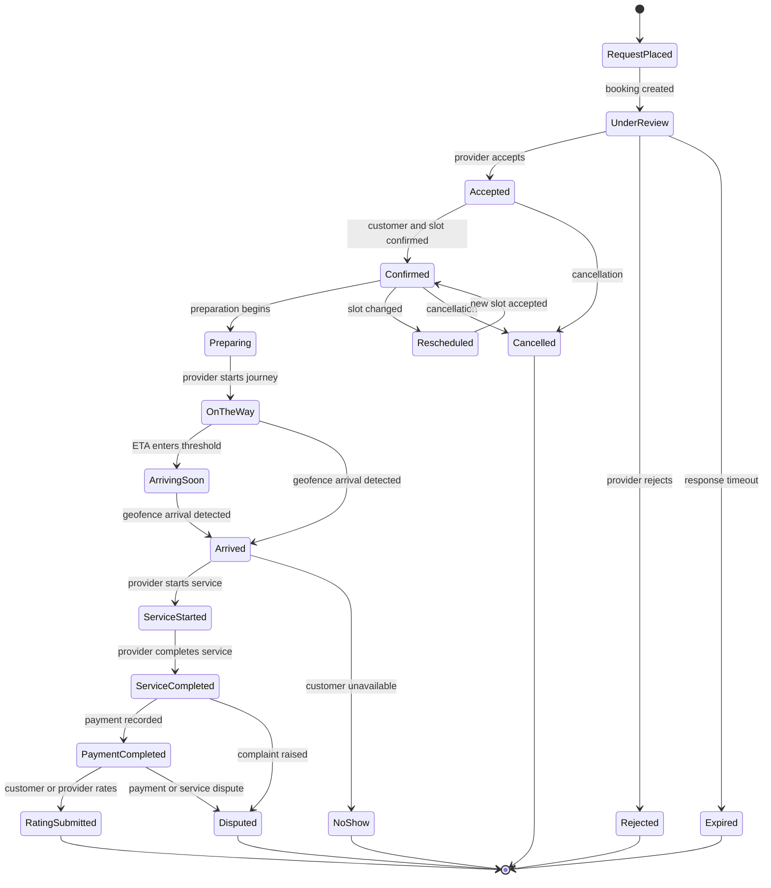

### State Rules

| State | Meaning | Allowed Actor |
|---|---|---|
| Request Placed | Customer has submitted a booking request | Customer |
| Under Review | Provider response is pending | System |
| Accepted | Provider accepted the request | Provider |
| Confirmed | Slot, customer, provider, and address are confirmed | Customer/System |
| Preparing | Provider is preparing for the appointment | Provider |
| On the Way | Provider has begun travel | Provider |
| Arriving Soon | ETA is within configured arrival threshold | System |
| Arrived | Provider entered the service geofence | System/Provider |
| Service Started | Work has begun | Provider |
| Service Completed | Work is marked complete | Provider/Customer |
| Payment Completed | Pay-after-service payment is recorded | Customer/Provider/System |
| Rating Submitted | Rating and review were submitted | Customer/Provider |
| Rejected | Provider rejected the request | Provider |
| Cancelled | Booking was cancelled under policy | Customer/Provider/Admin |
| Expired | Provider did not respond before timeout | System |
| Rescheduled | Existing booking slot was changed | Customer/Provider |
| No-show | Customer or provider failed to appear | Customer/Provider/Admin |
| Disputed | Complaint or payment/service dispute is active | Customer/Admin |

---

# 🗺️ Live Tracking, ETA and Geofencing

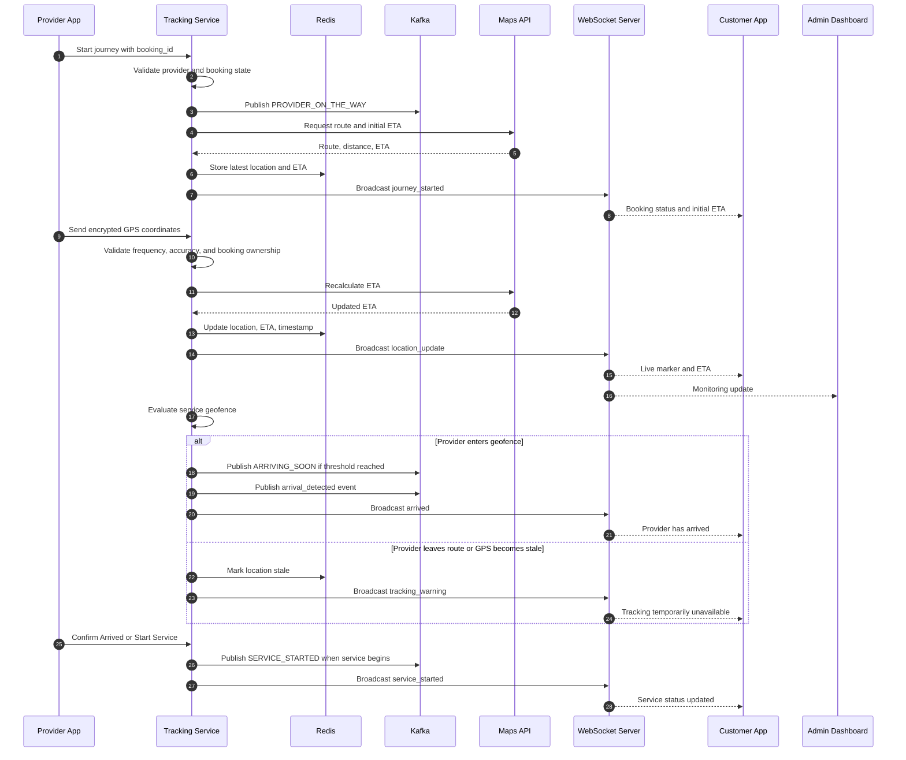

### Tracking Rules

- Location updates are accepted only for an active booking and authenticated provider.
- Redis stores the latest location with a short expiration time.
- PostgreSQL stores meaningful location checkpoints rather than every GPS point.
- The customer sees approximate live location and ETA; exact personal location history is restricted.
- Arrival is detected using a configurable radius around the service address and GPS accuracy checks.
- A stale-location warning is shown when no valid update arrives within the configured interval.
- The provider can stop sharing location after service completion or cancellation.
- Admin can inspect active journeys for support and safety purposes.

---

# 💬 Realtime Chat and Notifications

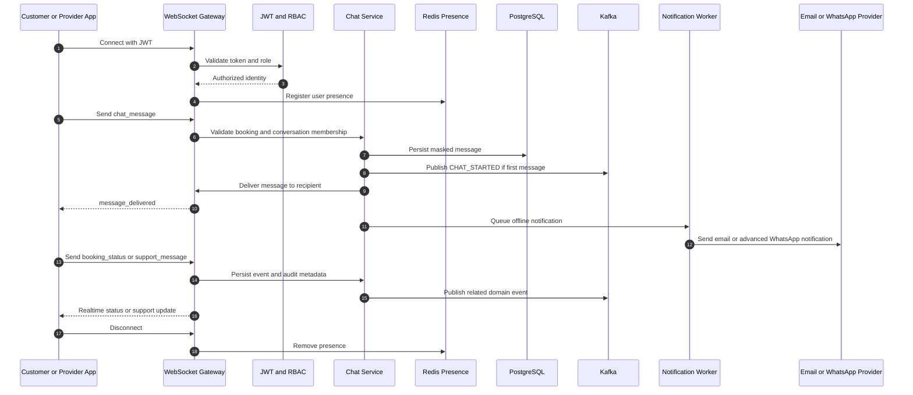

### WebSocket Event Table

| Event | Direction | Payload Summary | Use |
|---|---|---|---|
| `connection_ack` | Server to client | User ID, role, server time | Confirms authenticated connection |
| `chat_message` | Both directions | Conversation ID, message ID, body, timestamp | In-app chat |
| `message_delivered` | Server to client | Message ID, delivery time | Delivery confirmation |
| `message_read` | Both directions | Message ID, reader ID | Read receipts |
| `booking_status` | Server to client | Booking ID, state, reason | Lifecycle updates |
| `location_update` | Server to customer/admin | Booking ID, coordinates, ETA | Live tracking |
| `eta_update` | Server to customer | Booking ID, ETA, distance | Arrival planning |
| `arriving_soon` | Server to customer | Booking ID, threshold details | Arrival warning |
| `provider_arrived` | Server to customer | Booking ID, arrival time | Geofence detection |
| `notification_created` | Server to client | Notification ID, type, title, body | In-app notification |
| `support_message` | Both directions | Ticket ID, message, sender type | Customer-support chat |
| `ai_escalated` | Server to admin | Ticket ID, summary, reason | Human handoff |
| `presence_changed` | Server to permitted participants | User ID, online status | Chat presence |
| `tracking_warning` | Server to customer/admin | Booking ID, warning type | Stale or invalid GPS |

---

# 🧠 AI and ML Systems

## Explainable Provider Recommendation

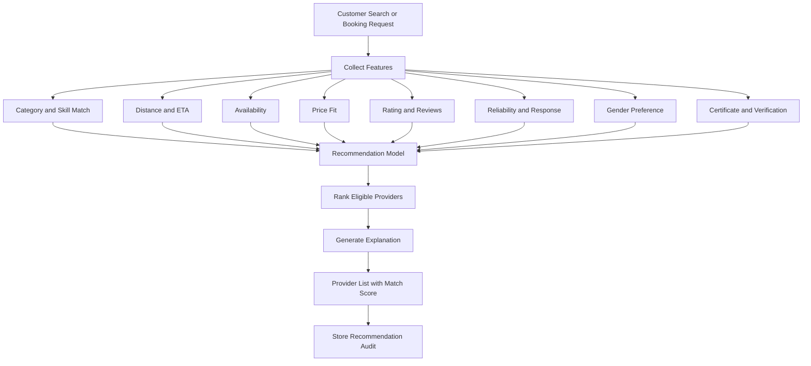

### Example Explanation

> **95% match because** the provider offers the requested plumbing service, is available in the selected slot, is 2.1 km away, has a 4.8 rating, has a 96% on-time rate, and matches the selected gender preference.

| Recommendation Feature | Initial Weight | Explanation |
|---|---:|---|
| Service and skill match | 25% | Provider can perform the requested service |
| Availability match | 15% | Provider is free during the selected slot |
| Distance and ETA | 15% | Provider can reach the customer quickly |
| Reliability score | 15% | Historical acceptance, attendance, and punctuality |
| Rating and sentiment | 10% | Quality signals from completed reviews |
| Price fit | 10% | Price aligns with customer budget |
| Experience and certificates | 5% | Relevant qualifications and experience |
| Gender preference | 5% | Applied only when selected by customer |

## Two-Sided Reliability Scoring

```text
ProviderReliability =
  0.25 * AcceptanceRate +
  0.20 * OnTimeRate +
  0.20 * CompletionRate +
  0.15 * ResponseScore +
  0.10 * (1 - CancellationRate) +
  0.10 * (1 - NoShowRate)

CustomerReliability =
  0.30 * AttendanceRate +
  0.20 * PaymentCompletionRate +
  0.20 * CancellationFairness +
  0.15 * ResponseScore +
  0.15 * BookingCompletionRate
```

| Score Component | Calculation Rule |
|---|---|
| Acceptance rate | Accepted requests divided by valid requests |
| On-time rate | Journeys arriving within the defined tolerance |
| Completion rate | Completed bookings divided by accepted bookings |
| Response score | Normalized response speed |
| Cancellation rate | Policy-adjusted cancellations divided by confirmed bookings |
| No-show rate | Confirmed bookings missed without valid reason |
| Attendance rate | Customer attendance at confirmed appointments |
| Payment completion rate | Completed payment obligations divided by completed services |
| Cancellation fairness | Rewards policy-compliant early cancellations |

Scores are normalized to 0–100, smoothed with a minimum-activity threshold, recalculated from Kafka events, and shown with a freshness timestamp.

## Behaviour-Based Provider Ranking

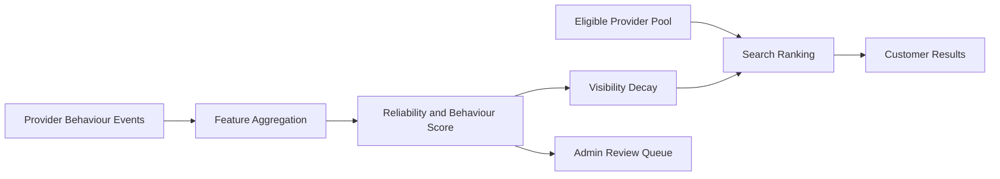

- Good behaviour increases visibility gradually.
- Repeated cancellations, no-shows, delayed responses, and poor completion reduce visibility.
- Visibility decay is reversible after sustained improvement.
- The system does not automatically ban providers solely because of a score.
- Safety, fraud, legal, and verification violations may still trigger an admin-controlled restriction.

## Fraud and Anomaly Detection

| Signal | Example Anomaly | Action |
|---|---|---|
| Account velocity | Many accounts from one device or IP | Add risk flag |
| Booking velocity | Unusual burst of bookings | Review or rate-limit |
| Location inconsistency | Provider location impossible for route | Mark tracking anomaly |
| Cancellation pattern | Repeated cancellations after acceptance | Reduce visibility and alert admin |
| Review pattern | Many reviews from related accounts | Sentiment and fraud review |
| Payment pattern | Repeated payment failures or disputes | Payment risk flag |
| Chat pattern | Contact-sharing attempts or abusive text | Mask, moderate, or escalate |

## Review Sentiment Analysis

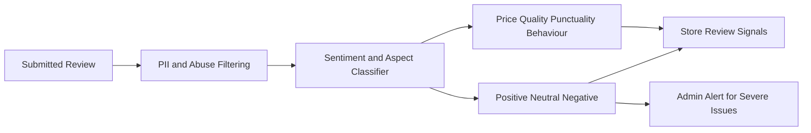

## Demand Prediction

| Input | Output |
|---|---|
| Historical bookings | Category demand trend |
| Location and service area | Location-wise demand |
| Hour, weekday, and season | Peak-hour forecast |
| Cancellations and completion | Effective demand |
| Provider supply | Supply-demand gap |
| Public holiday or event indicator | Demand spike adjustment |

The analytics service publishes forecast snapshots for admin dashboards and supplies demand features to the dynamic pricing recommendation service.

## Dynamic Pricing Recommendation

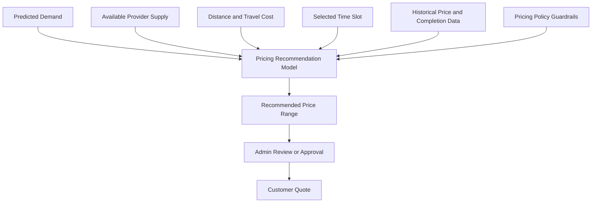

- v1 uses provider-defined pricing and transparent fees.
- Advanced pricing never changes a confirmed booking without customer consent.
- The UI displays the price basis, applicable fees, and validity period.
- Admin-configured floors, ceilings, and anti-discrimination rules override model output.

---

# 🤖 GenAI Support Agent and RAG

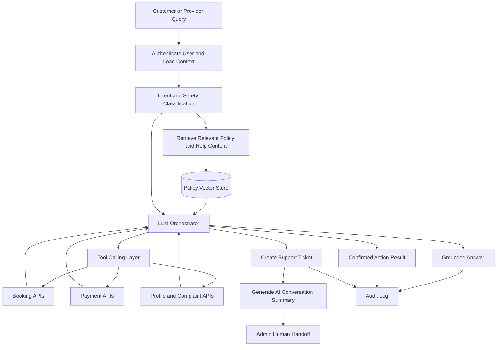

### Support Agent Controls

| Control | Requirement |
|---|---|
| Grounding | Answers must cite retrieved internal policy content in the agent context |
| Tool authorization | Tool calls inherit the authenticated user and role |
| Confirmation | Destructive or financial actions require explicit user confirmation |
| Payment safety | Agent cannot invent payment status or bypass payment verification |
| Privacy | The agent receives only the minimum booking and profile data required |
| Escalation | Low confidence, abuse, fraud, safety, and unresolved disputes create human handoff |
| Summary | Admin receives issue, timeline, attempted actions, sentiment, and recommended next step |
| Auditability | Prompt version, retrieved documents, tool calls, and final response are logged |
| Human control | Admin can correct, close, reopen, or override a support ticket |

---

# 🗄️ PostgreSQL Schema

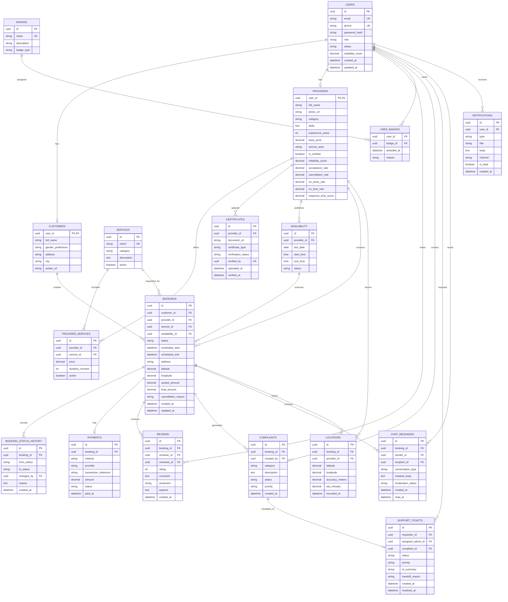

### Data Rules

- All primary keys are UUIDs.
- All tables include audit timestamps where applicable.
- Foreign keys use explicit delete behaviour defined in Alembic migrations.
- Booking status transitions are validated in the Booking service.
- Reviews require a completed booking and one review per reviewer-reviewee-booking combination.
- Provider certificates are private objects and are never served through public object URLs.
- Personal contact numbers are not stored in chat message bodies.

---

# 📨 Kafka Event Catalog

| Event | Topic | Partition Key | Producer | Consumers | Purpose |
|---|---|---|---|---|---|
| `USER_REGISTERED` | `identity.events` | `user_id` | Auth | Notifications, analytics, fraud | Record account creation |
| `PROVIDER_REGISTERED` | `provider.events` | `provider_id` | Provider Profile | Verification, notifications, analytics | Begin provider onboarding |
| `DOCUMENT_UPLOADED` | `verification.events` | `provider_id` | Verification | Admin queue, audit | Track submitted certificate |
| `DOCUMENT_VERIFIED` | `verification.events` | `provider_id` | Admin Verification | Provider Profile, notifications, analytics | Approve or reject document |
| `SERVICE_SEARCHED` | `catalog.events` | `customer_id` | Catalog | Recommendations, analytics | Capture search behaviour |
| `PROVIDER_VIEWED` | `catalog.events` | `provider_id` | Catalog | Recommendations, analytics | Capture provider interest |
| `BOOKING_CREATED` | `booking.events` | `booking_id` | Booking | Notifications, analytics, fraud | Notify and process request |
| `BOOKING_ACCEPTED` | `booking.events` | `booking_id` | Booking | Notifications, reliability | Update confirmed flow |
| `BOOKING_REJECTED` | `booking.events` | `booking_id` | Booking | Notifications, reliability, analytics | Record rejection |
| `BOOKING_CANCELLED` | `booking.events` | `booking_id` | Booking | Notifications, reliability, fraud, analytics | Apply cancellation effects |
| `BOOKING_RESCHEDULED` | `booking.events` | `booking_id` | Booking | Notifications, availability, analytics | Update slot and stakeholders |
| `PROVIDER_ON_THE_WAY` | `tracking.events` | `booking_id` | Tracking | Notifications, WebSocket gateway, analytics | Start live journey |
| `SERVICE_STARTED` | `booking.events` | `booking_id` | Booking | Notifications, analytics | Mark work started |
| `SERVICE_COMPLETED` | `booking.events` | `booking_id` | Booking | Payments, notifications, reliability | Trigger payment and review |
| `PAYMENT_COMPLETED` | `payment.events` | `booking_id` | Payment | Notifications, analytics, reliability | Confirm settlement |
| `REVIEW_SUBMITTED` | `review.events` | `reviewee_id` | Review | Sentiment, recommendations, analytics | Update quality signals |
| `COMPLAINT_CREATED` | `support.events` | `booking_id` | Complaint | Support AI, admin, fraud | Open issue workflow |
| `CHAT_STARTED` | `chat.events` | `conversation_id` | Chat | Notifications, analytics, support | Record conversation start |
| `AI_ESCALATED` | `support.events` | `ticket_id` | Support AI | Admin dashboard, notifications, analytics | Request human intervention |

### Event Envelope

```json
{
  "event_id": "uuid",
  "event_type": "BOOKING_CREATED",
  "event_version": 1,
  "occurred_at": "ISO-8601 timestamp",
  "producer": "booking-service",
  "partition_key": "booking_id",
  "actor_id": "uuid",
  "payload": {},
  "trace_id": "uuid"
}
```

---

# 🔐 Authentication and Security

## JWT Authentication Flow

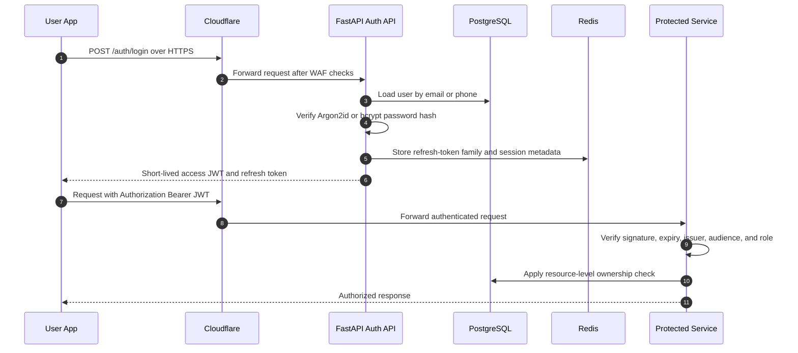

## RBAC Permission Matrix

| Capability | Customer | Provider | Admin |
|---|---:|---:|---:|
| Register and log in | Yes | Yes | Admin-controlled |
| Manage own profile | Yes | Yes | Yes |
| Search services and providers | Yes | Yes | Yes |
| Create own booking | Yes | No | Yes |
| Accept or reject assigned booking | No | Yes | Yes |
| Share journey location | No | Yes | Yes |
| View permitted booking location | Own booking | Own assigned booking | Active support cases |
| Send masked booking chat | Yes | Yes | Yes |
| Upload certificates | No | Yes | Yes |
| Verify certificates | No | No | Yes |
| View own earnings | No | Yes | Yes |
| View all payments | No | No | Yes |
| Submit rating or review | Yes | Yes | Yes |
| Create complaint or ticket | Yes | Yes | Yes |
| Manage all complaints | No | No | Yes |
| Operate support AI | Limited | Limited | Yes |
| View analytics dashboard | Personal | Personal | Yes |
| Manage users, services, badges | No | No | Yes |
| Review fraud alerts | No | No | Yes |

### Security Controls

- Passwords use Argon2id or bcrypt with unique salts; plaintext passwords are never stored.
- Access JWTs are short-lived; refresh tokens are rotated and revocable.
- JWT claims include subject, role, issuer, audience, issued time, and expiry.
- FastAPI dependencies enforce role checks and resource ownership checks.
- Cloudflare WAF, HTTPS, secure headers, and origin protection are enabled.
- Redis-backed rate limits protect login, OTP, search, chat, and support endpoints.
- CORS allows only registered frontend origins.
- Certificate uploads use MIME validation, size limits, antivirus scanning, private object storage, and signed download URLs.
- Database queries use parameterized ORM or query-builder operations.
- Chat messages pass through PII and contact-sharing filters.
- Customer and provider phone numbers are masked with platform relay identifiers.
- Admin actions require audit logs and elevated authentication.
- Secrets are provided through environment variables or a secrets manager.
- `.env` files are never committed to Git.

---

# 🧾 API Surface

The OpenAPI specification generated by FastAPI at `/docs` is the frozen integration contract. Any breaking API change requires a versioned endpoint or an approved contract change.

## Auth and Profiles

| Method | Path | Role | Purpose |
|---|---|---|---|
| POST | `/api/v1/auth/register` | Public | Register customer or provider |
| POST | `/api/v1/auth/login` | Public | Authenticate and issue tokens |
| POST | `/api/v1/auth/refresh` | Authenticated | Rotate access token |
| POST | `/api/v1/auth/logout` | Authenticated | Revoke refresh session |
| GET | `/api/v1/me` | All | Fetch current profile |
| PATCH | `/api/v1/me` | All | Update own profile |
| GET | `/api/v1/customers/{customer_id}` | Customer/Admin | View customer profile |
| GET | `/api/v1/providers/{provider_id}` | All | View provider profile |
| PATCH | `/api/v1/providers/me` | Provider | Update provider profile |
| GET | `/api/v1/providers/me/earnings` | Provider | View earnings |
| GET | `/api/v1/providers/me/metrics` | Provider | View reliability metrics |

## Catalog and Discovery

| Method | Path | Role | Purpose |
|---|---|---|---|
| GET | `/api/v1/services` | All | List active services |
| POST | `/api/v1/services` | Admin | Create service |
| PATCH | `/api/v1/services/{service_id}` | Admin | Update service |
| GET | `/api/v1/providers/search` | All | Search and filter providers |
| GET | `/api/v1/providers/nearby` | Customer | Discover nearby providers |
| GET | `/api/v1/providers/{provider_id}/services` | All | List provider services |
| POST | `/api/v1/providers/me/services` | Provider | Add offered service |
| PATCH | `/api/v1/providers/me/services/{id}` | Provider | Update provider service |
| GET | `/api/v1/providers/{provider_id}/availability` | All | View available slots |
| POST | `/api/v1/providers/me/availability` | Provider | Publish availability |
| POST | `/api/v1/recommendations/providers` | Customer | Get explainable recommendations |

## Bookings

| Method | Path | Role | Purpose |
|---|---|---|---|
| POST | `/api/v1/bookings` | Customer | Create booking request |
| GET | `/api/v1/bookings` | All | List role-scoped bookings |
| GET | `/api/v1/bookings/{booking_id}` | Participant/Admin | View booking |
| POST | `/api/v1/bookings/{booking_id}/accept` | Provider/Admin | Accept booking |
| POST | `/api/v1/bookings/{booking_id}/reject` | Provider/Admin | Reject booking |
| POST | `/api/v1/bookings/{booking_id}/confirm` | Customer/Admin | Confirm booking |
| POST | `/api/v1/bookings/{booking_id}/reschedule` | Participant/Admin | Request or apply reschedule |
| POST | `/api/v1/bookings/{booking_id}/cancel` | Participant/Admin | Cancel booking |
| POST | `/api/v1/bookings/{booking_id}/start` | Provider | Start service |
| POST | `/api/v1/bookings/{booking_id}/complete` | Provider | Complete service |
| GET | `/api/v1/bookings/{booking_id}/history` | Participant/Admin | View status timeline |

## Tracking, Chat and Notifications

| Method | Path | Role | Purpose |
|---|---|---|---|
| POST | `/api/v1/bookings/{booking_id}/tracking/start` | Provider | Start location sharing |
| POST | `/api/v1/bookings/{booking_id}/tracking/location` | Provider | Send location checkpoint |
| GET | `/api/v1/bookings/{booking_id}/tracking` | Participant/Admin | Get latest location and ETA |
| POST | `/api/v1/bookings/{booking_id}/chat` | Participant/Admin | Send fallback chat message |
| GET | `/api/v1/bookings/{booking_id}/chat` | Participant/Admin | Load chat history |
| GET | `/api/v1/notifications` | All | List notifications |
| PATCH | `/api/v1/notifications/{id}/read` | Recipient | Mark notification read |
| GET | `/api/v1/ws` | Authenticated | WebSocket connection |

## Payments, Reviews and Support

| Method | Path | Role | Purpose |
|---|---|---|---|
| POST | `/api/v1/bookings/{booking_id}/payment` | Customer/Provider | Record pay-after-service payment |
| GET | `/api/v1/bookings/{booking_id}/receipt` | Participant/Admin | Get receipt and QR code |
| POST | `/api/v1/payments/razorpay/order` | Customer | Create advanced payment order |
| POST | `/api/v1/payments/razorpay/webhook` | Razorpay | Verify payment webhook |
| POST | `/api/v1/bookings/{booking_id}/reviews` | Participant | Submit rating and review |
| POST | `/api/v1/complaints` | Customer/Provider | Create complaint |
| GET | `/api/v1/support/tickets` | Requester/Admin | List support tickets |
| POST | `/api/v1/support/chat` | Customer/Provider/Admin | Chat with support AI |
| POST | `/api/v1/support/tickets/{id}/escalate` | AI/Admin | Escalate to human |
| POST | `/api/v1/certificates` | Provider | Upload certificate metadata |
| GET | `/api/v1/admin/certificates` | Admin | Review verification queue |
| POST | `/api/v1/admin/certificates/{id}/verify` | Admin | Approve or reject certificate |

## Admin and Analytics

| Method | Path | Role | Purpose |
|---|---|---|---|
| GET | `/api/v1/admin/dashboard` | Admin | Dashboard summary |
| GET | `/api/v1/admin/users` | Admin | Manage users |
| PATCH | `/api/v1/admin/users/{id}/status` | Admin | Update account status |
| GET | `/api/v1/admin/bookings` | Admin | Monitor bookings |
| GET | `/api/v1/admin/payments` | Admin | Monitor payments |
| GET | `/api/v1/admin/complaints` | Admin | Manage complaints |
| GET | `/api/v1/admin/fraud-alerts` | Admin | Review anomaly alerts |
| GET | `/api/v1/admin/analytics/demand` | Admin | Demand and peak-hours analytics |
| GET | `/api/v1/admin/analytics/revenue` | Admin | Revenue analytics |
| GET | `/api/v1/admin/analytics/providers` | Admin | Provider performance analytics |
| POST | `/api/v1/admin/badges` | Admin | Create badge |
| POST | `/api/v1/admin/users/{id}/badges` | Admin | Award badge |

---

# ☁️ CI/CD and Deployment

```mermaid
flowchart LR
    DEV[Developer Feature Branch]
    PR[Pull Request]
    GITHUB[GitHub Protected Repository]
    JENKINS[Jenkins Webhook Pipeline]
    TEST[Lint Unit Integration Contract Tests]
    BUILD[Docker Build]
    SCAN[Dependency and Image Scan]
    REGISTRY[Container Registry]
    STAGE[Stage Deployment]
    APPROVAL[Manual Production Approval]
    PROD[Production Cloud Runtime]
    CF[Cloudflare DNS CDN SSL WAF]
    MON[Logs Metrics Alerts]

    DEV --> PR
    PR --> GITHUB
    GITHUB --> JENKINS
    JENKINS --> TEST
    TEST --> BUILD
    BUILD --> SCAN
    SCAN --> REGISTRY
    REGISTRY --> STAGE
    STAGE --> APPROVAL
    APPROVAL --> PROD
    PROD --> CF
    PROD --> MON
```

## Environments

| Environment | Purpose | Database | Deployment | Data Policy |
|---|---|---|---|---|
| Dev | Local feature development | Docker PostgreSQL | Docker Compose | Seeded synthetic data |
| Stage | Integration and demo rehearsal | Isolated PostgreSQL | Jenkins automatic after merge to develop | Synthetic or anonymized data |
| Prod | Final hosted application | Managed PostgreSQL with backups | Approved release from main | Real data, restricted access |

## Docker Compose Services

```text
postgres
redis
zookeeper
kafka
kafka-ui
backend-api
tracking-service
notification-worker
ai-service
ml-service
web-frontend
jenkins
```

### Pipeline Gates

1. Install dependencies with lockfiles.
2. Run formatting and lint checks.
3. Run unit tests.
4. Run API integration tests.
5. Validate OpenAPI contract.
6. Run database migration checks.
7. Build Docker images.
8. Scan dependencies and images.
9. Push immutable image tags.
10. Deploy to stage.
11. Run smoke tests.
12. Require approval before production deployment.

---

# 📁 Monorepo Layout

A **single React application with role-based routes** is selected to minimize duplicated components, simplify shared authentication, and keep the two-person team from maintaining three separate frontend build systems.

```text
smart-booking-system/
├── README.md
├── LICENSE
├── Makefile
├── .env.example
├── .gitignore
├── .dockerignore
├── docker-compose.yml
├── architecture.md
├── frontend/
│   ├── package.json
│   ├── package-lock.json
│   ├── tsconfig.json
│   ├── vite.config.ts
│   ├── public/
│   └── src/
│       ├── main.tsx
│       ├── App.tsx
│       ├── routes/
│       │   ├── CustomerRoutes.tsx
│       │   ├── ProviderRoutes.tsx
│       │   ├── AdminRoutes.tsx
│       │   └── ProtectedRoute.tsx
│       ├── api/
│       │   ├── client.ts
│       │   ├── authApi.ts
│       │   ├── bookingApi.ts
│       │   ├── providerApi.ts
│       │   └── supportApi.ts
│       ├── components/
│       │   ├── common/
│       │   ├── booking/
│       │   ├── tracking/
│       │   ├── chat/
│       │   └── analytics/
│       ├── features/
│       │   ├── auth/
│       │   ├── customer/
│       │   ├── provider/
│       │   ├── admin/
│       │   ├── catalog/
│       │   ├── booking/
│       │   ├── tracking/
│       │   ├── chat/
│       │   ├── notifications/
│       │   └── support/
│       ├── hooks/
│       ├── store/
│       ├── types/
│       ├── utils/
│       └── styles/
├── backend/
│   ├── pyproject.toml
│   ├── alembic.ini
│   ├── alembic/
│   │   ├── env.py
│   │   └── versions/
│   ├── app/
│   │   ├── main.py
│   │   ├── config.py
│   │   ├── dependencies.py
│   │   ├── api/
│   │   │   ├── v1/
│   │   │   │   ├── auth.py
│   │   │   │   ├── profiles.py
│   │   │   │   ├── catalog.py
│   │   │   │   ├── bookings.py
│   │   │   │   ├── tracking.py
│   │   │   │   ├── chat.py
│   │   │   │   ├── payments.py
│   │   │   │   ├── reviews.py
│   │   │   │   ├── support.py
│   │   │   │   └── admin.py
│   │   │   └── websocket.py
│   │   ├── core/
│   │   │   ├── security.py
│   │   │   ├── database.py
│   │   │   ├── redis.py
│   │   │   ├── kafka.py
│   │   │   └── logging.py
│   │   ├── models/
│   │   ├── schemas/
│   │   ├── repositories/
│   │   ├── services/
│   │   │   ├── auth/
│   │   │   ├── catalog/
│   │   │   ├── booking/
│   │   │   ├── tracking/
│   │   │   ├── chat/
│   │   │   ├── payments/
│   │   │   ├── notifications/
│   │   │   ├── verification/
│   │   │   └── support/
│   │   ├── workers/
│   │   └── tests/
│   └── Dockerfile
├── ml/
│   ├── recommendation/
│   ├── reliability/
│   ├── sentiment/
│   ├── fraud/
│   ├── demand/
│   ├── pricing/
│   ├── common/
│   ├── tests/
│   ├── requirements.txt
│   └── Dockerfile
├── infra/
│   ├── docker/
│   │   ├── backend.Dockerfile
│   │   ├── frontend.Dockerfile
│   │   ├── ml.Dockerfile
│   │   └── nginx.conf
│   ├── jenkins/
│   │   ├── Jenkinsfile
│   │   └── scripts/
│   ├── cloudflare/
│   │   └── README.md
│   ├── monitoring/
│   └── environments/
│       ├── dev.env.example
│       ├── stage.env.example
│       └── prod.env.example
├── docs/
│   ├── api-contract.md
│   ├── database.md
│   ├── deployment.md
│   ├── runbook.md
│   ├── adr/
│   └── diagrams/
├── .github/
│   ├── pull_request_template.md
│   ├── ISSUE_TEMPLATE/
│   └── workflows/
│       └── contract-check.yml
└── scripts/
    ├── wait-for-services.sh
    ├── seed_demo_data.py
    └── smoke_test.sh
```

---

# 👥 Two-Person Team Operating Plan

## Ownership Matrix

| Module or Area | Primary Owner | Backup and Review |
|---|---|---|
| Auth and RBAC | Dev-1 | Dev-2 |
| Customer profile | Dev-1 | Dev-2 |
| Catalog and search | Dev-1 | Dev-2 |
| Booking lifecycle | Dev-1 | Dev-2 |
| Payments and receipts | Dev-1 | Dev-2 |
| Recommendation AI | Dev-1 | Dev-2 |
| Review sentiment | Dev-1 | Dev-2 |
| Dynamic pricing | Dev-1 | Dev-2 |
| Support AI and RAG | Dev-1 | Dev-2 |
| API contracts and backend schemas | Dev-1 | Dev-2 |
| Provider profile | Dev-2 | Dev-1 |
| Availability calendar | Dev-2 | Dev-1 |
| Provider verification | Dev-2 | Dev-1 |
| Live tracking and ETA | Dev-2 | Dev-1 |
| Geofencing and arrival detection | Dev-2 | Dev-1 |
| Chat and masked contact | Dev-2 | Dev-1 |
| Notifications | Dev-2 | Dev-1 |
| Reliability scoring | Dev-2 | Dev-1 |
| Fraud and anomaly detection | Dev-2 | Dev-1 |
| Demand prediction | Dev-2 | Dev-1 |
| Analytics dashboards | Dev-2 | Dev-1 |
| Docker and Jenkins | Dev-2 | Dev-1 |
| Cloudflare deployment | Dev-2 | Dev-1 |
| Customer frontend | Dev-1 | Dev-2 |
| Provider frontend | Dev-2 | Dev-1 |
| Admin frontend | Dev-2 | Dev-1 |
| Shared UI primitives | Dev-1 | Dev-2 |
| Database migrations | Dev-1 for auth/booking/payment tables | Dev-2 for provider/tracking/analytics tables |
| Documentation | Dev-1 for API and architecture | Dev-2 for deployment and operations |
| Final integration | Shared | Both must review |

## API-First Contract Rule

1. The owning developer proposes the endpoint, request schema, response schema, status codes, and error format.
2. The contract is added to FastAPI and documented in `/docs`.
3. The frontend consumes the contract through typed API clients.
4. No frontend feature is considered complete using undocumented mock response shapes.
5. Breaking changes require a new version or explicit approval in the pull request.
6. Contract tests run before merge.

## Daily Ten-Minute Standup

Each developer answers:

1. What did I complete yesterday?
2. What will I do today?
3. What is blocked?

## Milestone Schedule

| Milestone | Period | Deliverable | Gate |
|---|---|---|---|
| M1 Foundation | Week 1–2 | Monorepo, Docker Compose, PostgreSQL schema, FastAPI skeleton, React app shell, Auth and RBAC | Login and register working end-to-end |
| M2 Core Booking | Week 3–4 | Catalog, search, booking lifecycle, availability, customer and provider profiles, basic frontend flows | Booking created, accepted, completed, and reviewed |
| M3 Realtime | Week 5–6 | WebSockets, live tracking, chat, in-app notifications, geofencing | Customer sees live location and ETA, chat works |
| M4 Payments | Week 7 | Pay-after-service, receipts, QR code, payment status tracking | Payment recorded after service completion |
| M5 AI Core | Week 8–9 | Recommendation engine, reliability scoring, sentiment analysis, behaviour-based ranking | Explainable recommendations shown in search results |
| M6 Support AI | Week 10 | RAG support agent, ticket creation, human handoff, admin support dashboard | Customer chats with AI agent, ticket escalated to admin |
| M7 Advanced | Week 11–12 | Fraud detection, demand prediction, dynamic pricing, Razorpay adapter, analytics dashboards | Admin sees analytics and fraud alerts |
| M8 Polish | Week 13–14 | End-to-end testing, performance tuning, security hardening, documentation, demo rehearsal | System passes integration and security review |

---

# 📐 Coding Standards

## Backend

- All code is formatted with Black and checked with Ruff.
- Type annotations are mandatory on all function signatures.
- Every endpoint uses Pydantic request and response models.
- Repository pattern isolates database access from service logic.
- Service functions contain business logic; endpoints are thin orchestration wrappers.
- Tests use pytest; fixtures share database session and test client setup.
- Alembic manages all schema changes.
- `.env` files are never committed; `.env.example` documents required variables.

## Frontend

- Strict TypeScript; `any` is not permitted.
- ESLint and Prettier enforce consistent formatting.
- API clients are auto-generated or strongly typed against backend schemas.
- Reusable components live in `components/common/`; feature-specific components live in `features/`.
- State management uses React context or a lightweight store; global state is minimal.
- Forms use controlled components with validation.
- Routing guards check authenticated role before rendering protected pages.

## Git

- Protected `main` and `develop` branches.
- Feature branches are named `feature/<module>/<short-description>`.
- Pull requests require one review from the other developer.
- Commit messages follow conventional-commits format.
- CI runs lint, test, and contract checks before merge.

---

# 📎 Appendix

## Glossary

| Term | Definition |
|---|---|
| Booking | A service appointment between a customer and a provider |
| Provider | A verified professional who offers services |
| Customer | A registered user who books services |
| RBAC | Role-based access control |
| Geofence | Virtual boundary around the service address for arrival detection |
| ETA | Estimated time of arrival |
| RAG | Retrieval-augmented generation |
| COD | Cash on delivery or pay-after-service |
| ADR | Architecture decision record |
| Reliability score | Weighted metric representing user trustworthiness |
| Visibility decay | Gradual reduction in search ranking for providers with poor behaviour |
| Masked contact | Phone numbers replaced with platform relay identifiers |

## Decision Log

| Decision | Rationale | Date |
|---|---|---|
| Single React app with role-based routes | Reduces duplication for a two-person team | 13 Aug 2026 |
| PostgreSQL as source of truth | ACID compliance, relational integrity, mature ecosystem | 13 Aug 2026 |
| Kafka for domain events | Decouples services, enables replay, supports analytics pipelines | 13 Aug 2026 |
| Redis for cache and presence | Low-latency ephemeral data, rate limiting, WebSocket coordination | 13 Aug 2026 |
| Pay-after-service as v1 payment | Simplest payment model to launch quickly | 13 Aug 2026 |
| Argon2id for password hashing | Memory-hard, GPU-resistant, recommended by OWASP | 13 Aug 2026 |
| JWT with short-lived access tokens | Stateless verification, revocable refresh tokens | 13 Aug 2026 |
| Explainable recommendations | User trust and regulatory transparency | 13 Aug 2026 |
| Visibility decay over automatic bans | Reversible consequence, avoids legal risk | 13 Aug 2026 |
| OpenAPI as frozen contract | Prevents frontend-backend integration drift | 13 Aug 2026 |
